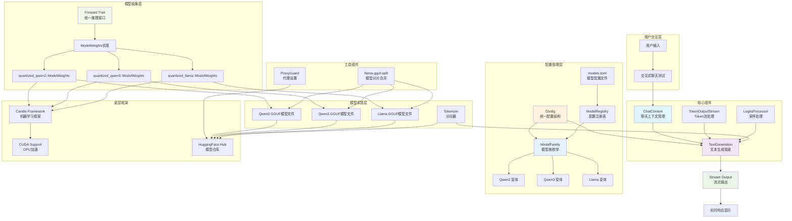

# hf-llm-chat

一个基于 [Candle](https://github.com/huggingface/candle) 机器学习框架的 LLM 聊天机器人。
本项目提供了一个易于使用、支持流式输出和 GPU 加速的聊天机器人实现，支持多种 GGUF 格式的量化大语言模型。采用现代化的 Rust 异步设计，具有类型安全的模型配置系统。

## ✨ 功能特性

-   **多模型支持**: 支持 Qwen2/Qwen3/Llama 系列模型，通过 `models.toml` 配置文件管理
-   **类型安全配置**: 基于 `ModelFamily` 枚举的编译时模型选择，避免运行时配置错误
-   **流式输出**: 实现打字机效果的实时响应，提升用户体验
-   **GPU 加速**: 支持 CUDA，可利用 NVIDIA GPU 进行高效推理
-   **异步处理**: 基于 Tokio 的异步设计，确保应用性能
-   **智能聊天上下文**: 自动角色切换和思考过程过滤的 `ChatContext` 管理
-   **配置灵活**: 通过 `Config` 结构体和 TOML 文件轻松调整模型参数

## 🚀 快速开始

### 1. 环境要求

-   Rust 工具链 (推荐最新稳定版)
-   CUDA 工具包 (若需使用 GPU 加速)

### 2. 下载与运行

```bash
git clone https://github.com/your-username/hf-llm-chat.git # 替换为您的仓库地址
cd hf-llm-chat
```

#### 设置代理 (可选)

如果在中国大陆或其他网络受限地区下载 Hugging Face 模型，可能需要设置代理。项目提供了 `ProxyGuard` 工具类：

```rust
use hf_llm_chat::utils::ProxyGuard;

// 设置代理，ProxyGuard 会在作用域结束时自动清理
let _proxy = ProxyGuard::new("7890"); // 端口号，完整地址为 http://127.0.0.1:7890
```

`ProxyGuard` 实现了 RAII 模式，会在析构时自动清理环境变量。

### 3. 运行测试

**交互式聊天测试**：
```bash
cargo test --package hf-llm-chat --lib tests::test_pipeline -- --nocapture
```

**预设对话测试**：
```bash
cargo test --package hf-llm-chat --lib tests::test_prompt -- --nocapture
```

这些测试将演示模型加载、聊天上下文管理和流式输出功能。

### 4. 模型配置

项目支持多种预配置模型，在 `models.toml` 中定义：

- **Qwen2 系列**: 1.5B, 7B, 14B 参数模型
- **Qwen3 系列**: 4B, 8B, 14B, 32B 参数模型  
- **Llama 系列**: 包含 DeepSeek-R1-Distill-Llama-8B

默认使用 Qwen3-8B 模型，可通过代码或配置文件切换：

```rust
// 使用特定模型
let config = Config::qwen2("W25_7b");
let config = Config::qwen3("W3_14b");
let config = Config::with_model(ModelFamily::llama("DeepseekR1Llama8b"));
```

## ⚙️ 配置

### 主要配置文件

**`src/models/config.rs`** - 核心配置结构：

```rust
pub struct Config {
    pub hparams: HParams,    // 生成参数
    pub device: Device,      // 计算设备 (CPU/CUDA)
    pub model: ModelFamily,  // 模型选择
}

pub struct HParams {
    pub sample_len: usize,      // 生成响应的最大 token 数量 (默认: 1000)
    pub temperature: f64,       // 控制随机性 (默认: 0.8)
    pub top_p: Option<f64>,     // Nucleus 采样概率
    pub seed: u64,              // 随机种子 (默认: 299792458)
    pub repeat_penalty: f32,    // 重复惩罚系数 (默认: 1.1)
    pub repeat_last_n: usize,   // 重复惩罚上下文长度 (默认: 64)
}
```

**`models.toml`** - 模型仓库配置：

```toml
[qwen3.W3_8b]
model_repo = "Qwen/Qwen3-8B-GGUF"
model_file = "Qwen3-8B-Q4_K_M"
tokenizer_repo = "Qwen/Qwen3-8B"
default = true
```

**`config.toml`** - HuggingFace 访问令牌等全局配置

### 使用示例

**基本聊天流式输出**：

```rust
use hf_llm_chat::{Config, TextGeneration};
use futures_util::{StreamExt, pin_mut};

#[tokio::main]
async fn main() -> anyhow::Result<()> {
    // 使用默认配置 (Qwen3-8B)
    let config = Config::default();
    let mut text_gen = TextGeneration::new(config).await?;
    
    // 流式聊天
    let stream = text_gen.chat("你好，请介绍一下自己");
    pin_mut!(stream);
    
    while let Some(Ok(token)) = stream.next().await {
        print!("{}", token);
    }
    
    Ok(())
}
```

**选择特定模型**：

```rust
// 使用 Qwen2-7B 模型
let config = Config::qwen2("W25_7b");

// 使用 Qwen3-14B 模型  
let config = Config::qwen3("W3_14b");

// 使用 DeepSeek-R1-Llama-8B 模型
let config = Config::with_model(ModelFamily::llama("DeepseekR1Llama8b"));
```

**自定义生成参数**：

```rust
let mut config = Config::default();
config.hparams.temperature = 0.7;
config.hparams.sample_len = 2000;
config.hparams.repeat_penalty = 1.2;
```

## 📦 GGUF 模型与分片处理

本项目支持 GGUF 格式的模型。对于分片的 GGUF 模型文件，需要使用 `llama-gguf-split` 工具进行合并。

### 依赖: `llama-gguf-split`

`llama-gguf-split` 是一个外部运行时依赖。如果需要加载分片模型，请确保已按照以下步骤安装并将其添加到系统 PATH：

1.  克隆 `llama.cpp` 仓库:
    ```bash
    git clone --recursive https://github.com/ggerganov/llama.cpp
    ```
2.  编译安装:
    ```bash
    cd llama.cpp
    cmake -S . -B build
    cmake --build build --config Release
    ```
3.  将生成的可执行文件 (通常在 `build/bin` 目录下) 添加到系统 PATH。

### 自动合并

程序在下载模型时，如果检测到模型文件是分片的，会自动调用 `llama-gguf-split` 进行合并。合并后的完整模型文件将保存在与分片文件相同的目录下。

参考资料:
- [How to use the gguf-split / Model sharding demo](https://github.com/ggml-org/llama.cpp/discussions/6404)

## 🏗️ 项目架构



### 架构说明

#### 核心设计模式

**1. 简化的配置系统**
- `Config`: 统一配置结构，包含生成参数、设备和模型选择
- `ModelFamily`: 枚举类型，支持 Qwen2/Qwen3/Llama 三大模型族
- `ModelRegistry`: 从 `models.toml` 加载模型配置的注册表系统

**2. 模型族管理**
```rust
pub enum ModelFamily {
    Qwen2(String),   // 如 "W25_7b", "W25_14b"
    Qwen3(String),   // 如 "W3_8b", "W3_14b", "W3_32b"  
    Llama(String),   // 如 "DeepseekR1Llama8b"
}
```

**3. 统一推理接口**
```rust
pub trait Forward {
    fn forward(&mut self, x: &Tensor, index_pos: usize) -> Result<Tensor>;
}

// 通过宏为所有模型权重实现 Forward trait
impl_model_traits!(quantized_llama, quantized_qwen2, quantized_qwen3);
```

#### 核心流程
1. **配置加载** → `ModelRegistry` 从 `models.toml` 读取模型配置
2. **模型选择** → `ModelFamily` 枚举确定具体模型和变体
3. **异步加载** → `Config::setup_model()` 异步加载 GGUF 模型和分词器
4. **推理执行** → `Forward` trait 统一推理接口
5. **流式输出** → `TextGeneration::chat()` 返回异步流

#### 关键组件
- **ModelFamily**: 类型安全的模型选择，支持默认模型和变体选择
- **ModelRegistry**: TOML 配置文件驱动的模型注册表
- **Config**: 简化的配置管理，支持便利构造方法
- **ChatContext**: 智能聊天上下文，自动角色切换和思考过程过滤
- **TextGeneration**: 核心文本生成管道，支持流式输出
- **宏系统**: `impl_model_traits!` 自动为模型实现必要 trait

#### 技术特性
- 🎯 **类型安全**: 编译时模型类型检查，运行时配置验证
- 🔧 **配置驱动**: 通过 TOML 文件管理模型，易于扩展新模型
- 🔄 **异步优先**: 全异步设计，模型加载和推理均为异步
- 🚀 **GPU 加速**: 自动检测 CUDA 设备，提升推理性能
- 📡 **流式输出**: 基于 async-stream 的实时响应
- 🛠️ **简化架构**: 移除复杂的泛型系统，采用更直观的枚举设计

## 📁 项目结构

```
src/
├── lib.rs                 # 库入口
├── pipe.rs                # TextGeneration 核心管道
├── models/
│   ├── mod.rs            # Forward trait 和宏定义
│   ├── config.rs         # Config 和 HParams 配置结构
│   └── registry.rs       # ModelFamily 和 ModelRegistry
├── utils/
│   ├── mod.rs            # 工具函数和 ProxyGuard
│   ├── load.rs           # 模型和分词器加载
│   └── chat.rs           # ChatContext 聊天上下文
└── tests/
    └── mod.rs            # 测试用例

配置文件:
├── models.toml           # 模型仓库配置
├── config.toml           # 全局配置 (HF token 等)
└── Cargo.toml            # 项目依赖
```

## 🔧 扩展新模型

添加新模型只需要两步：

1. **在 `models.toml` 中添加配置**：
```toml
[qwen3.W3_72b]
model_repo = "Qwen/Qwen3-72B-GGUF"
model_file = "Qwen3-72B-Q4_K_M"
tokenizer_repo = "Qwen/Qwen3-72B"
```

2. **在代码中使用**：
```rust
let config = Config::qwen3("W3_72b");
```

对于新的模型族，需要：
- 在 `ModelFamily` 枚举中添加新变体
- 在 `Config::setup_model()` 中添加对应的加载逻辑
- 确保 Candle 框架支持该模型架构

## 📝 许可证

本项目采用 MIT 许可证。详情请参阅 [LICENSE](LICENSE) 文件。